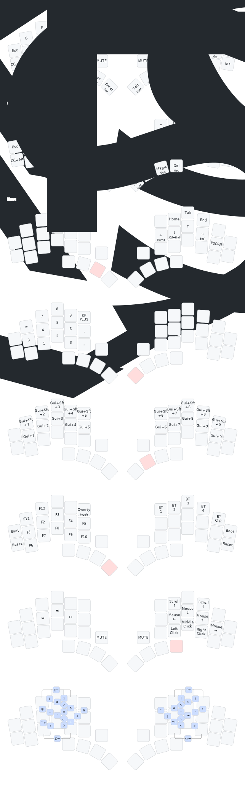

# ZMK Config for KLOR Keyboard

This repository contains a ZMK configuration for the KLOR split keyboard with two alpha layouts: **Night** and **QWERTY**.

## Layouts

### Night Layout
This configuration features the Night layout, an alternative keyboard layout optimized for comfort and efficiency. 

### QWERTY Layout
Traditional QWERTY layout is also available for familiar typing experience.

## Features

- **Two alpha layers**: Night and QWERTY layouts
- **Combo support**: Uses kombol-inspired combos for enhanced functionality
- **Layer management**: Multiple layers for navigation, numbers, function keys, and mouse control
- **Bluetooth support**: Multiple device pairing and switching
- **Homerow mods**: Modifier keys on home row for ergonomic typing

## Credits

- **Night Layout**: [LumineSpire Night Design](https://luminespire.github.io/night/design.html)
- **ZMK Helpers**: [urob/zmk-helpers](https://github.com/urob/zmk-helpers)
- **Base Configuration**: [urob/zmk-config](https://github.com/urob/zmk-config)
- **Combo Inspiration**: [skychil/kombol](https://github.com/skychil/kombol)

## Installation

1. Fork this repository
2. Enable GitHub Actions in your fork
3. Push changes to trigger the build
4. Download the firmware from the Actions tab
5. Flash the `.uf2` files to your KLOR halves

## License

This configuration is provided under the MIT License.